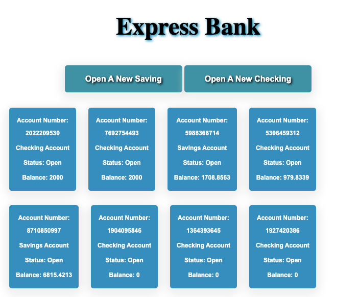
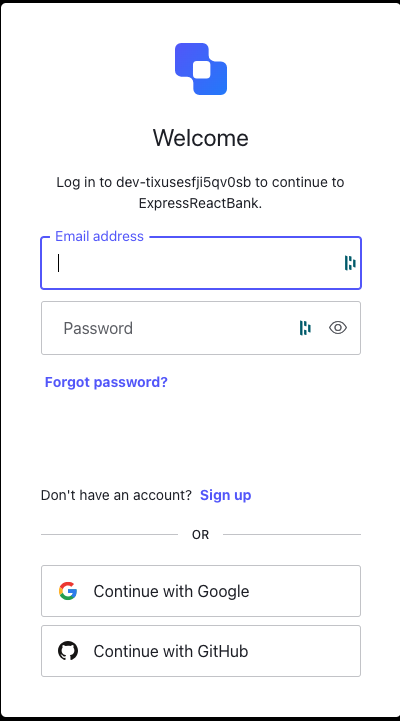
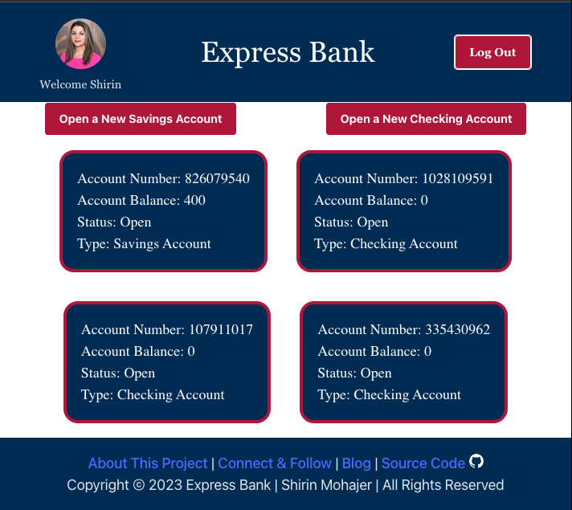
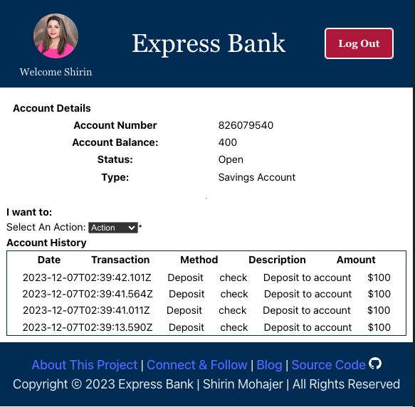

<p align="center">
  <a href="" rel="noopener">
 </a>
</p>

<h3 align="center">Mongo Express Bank</h3>

<div align="center">

[](active)
[](https://github.com/kylelobo/The-Documentation-Compendium/issues)
[](https://github.com/kylelobo/The-Documentation-Compendium/pulls)
[](/LICENSE)

</div>

---

# express-mongo-bank

<p align="center"> Bank System Experimenting with Express and MongoDB
    <br> 
</p>

## 📝 Table of Contents

- [About](#about)
- [Versions:](#versions)
  - 🔧 [V1](#v1)
    - [Built Using](built_using_v1)
    - [Goals](goals)
    - [Stretch Goals](strech_goals)
  - 🔧 [V2](#v2)
    - [Built Using](built_using_v2)  
- [Authors](#authors)
- [Acknowledgments](#acknowledgement)

# Mongo Express Bank

This is a experimental project to create a full CRUD app using the best practices and latest tech stack.

To do so, we're experimenting with a banking system and the goal is to user:

- Create accounts(Saving and Checking) - Create
- Create Log Record Per Transaction - Create
- Display Account Details & Transactions History - Read
- Deposit Funds - Update
- Withdraw Funds - Update
- Close an account - Delete


# Setup an express project(will be moved later):

```sh
npm init -y
npm i cors express mongoose morgan nodemon chance
touch server.js //server route
touch .ignore //add node_modules
```

Update your Scripts block in your package.json

```json
  "scripts": {
    "start": "node server.js",
    "dev": "nodemon server.js"
  },
```

For your `index.html`

```html
<script src="https://unpkg.com/axios/dist/axios.min.js"></script>
<script src=".scripts/script.js" type="module" defer></script>
<link rel="stylesheet" href="style/style.css" />
```
# Setup mongo db (will be moved later):

config/db file,

```js
const mongoose = require("mongoose");

mongoose
  .connect("mongodb://127.0.0.1:27017/mongoBankExpress")
  .then(() => {
    console.log("Successfully connected to MongoDB.");
  })
  .catch((e) => {
    console.error("Connection error", e.message);
  });

const db = mongoose.connection;

module.exports = db;
```

# Versions <a name = "#versions"></a>

## 🔧 V1 <a name = "#v1"></a> [express-mongo-bank](https://github.com/shirinmjr/express-mongo-bank)

## ⛏️ Built Using <a name = "#built_using_v1"></a>

- [MongoDB](https://www.mongodb.com/) - Database
  - mongoose - Database Framework
  - nodemon
- [Express](https://expressjs.com/) - Server Framework
- [NodeJs](https://nodejs.org/en/) - Server Environment
- [CORS](https://www.npmjs.com/package/cors) - Connect/Express middleware
- [Morgan](https://www.npmjs.com/package/morgan) - HTTP request logger middleware for node.js
- [Live Server](https://marketplace.visualstudio.com/items?itemName=ritwickdey.LiveServer) - A Quick Development Live Server with live browser reload.

make sure you have live Server extension installed

Goals <a name = "#goals"></a>

1. Create one user total (✓)
2. User can create new account by selecting _Create A New Account_ button (Saving / Checking) (✓)
3. User can see the account number, balance and the status of the account (if it's open) (✓)
4. Select and account takes user to the account details page (✓)
5. Uer can deposit/withdraw and transfer to/from all of their account via cash,check (✓)
6. User can delete their account but they need to transfer the balance before that. Balance need to be 0 before request to close an account (✓)
7. User can see a history of transactions in their account page(reflecting account transactions). (✓)

### Stretch Goals<a name = "#stretch_goals"></a>

1. Account history gets updated as transactions happened (✓)
2. User can transfer money from one account to another account and can see a history record on bot(to/from) accounts (✓)

Previews:

<p align="center">
 
 
  
</p>

## 🔧 V2 <a name = "#v2"></a>

## ⛏️ Built Using <a name = "built_using_v2"></a>

- [MongoDB](https://www.mongodb.com/) - Database
  - mongoose - Database Framework
  - nodemon
- [Express](https://expressjs.com/) - Server Framework
- [NodeJs](https://nodejs.org/en/) - Server Environment
- [CORS](https://www.npmjs.com/package/cors) - Connect/Express middleware
- [Morgan](https://www.npmjs.com/package/morgan) - HTTP request logger middleware for node.js
- [Live Server](https://marketplace.visualstudio.com/items?itemName=ritwickdey.LiveServer) - A Quick Development Live Server with live browser reload.

make sure you have live Server extension installed


1. User can login (Google Auth) (✓)
2. User can login (GitHub) (✓)
3. Migrate UI from ES6 to React (✓)
4. There is no business logic handled in the front-end (✓)
5. Both front-end and back-end are managed in the same repo (✓)

### Stretch Goals<a name = "#stretch_goals"></a>

1. Account history displays in pagination
2. Account history can be searched
3. Account history can be filtered
4. Improve styling (mobile friendly)


### Stretch Goals - it's always a nice surprise!
<p align="center">
 
 
  
</p>
## 🚀 Run & Deployment <a name = "deployment"></a>

Add additional notes about how to deploy this on a live system.

## ✍️ Authors <a name = "authors"></a>

[Shirin](https://github.com/shirinmjr) - Idea & Initial work

## 🎉 Acknowledgements <a name = "acknowledgement"></a>
