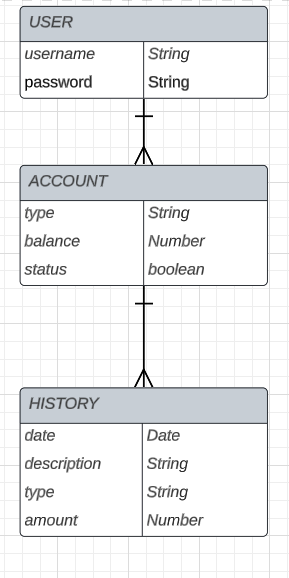
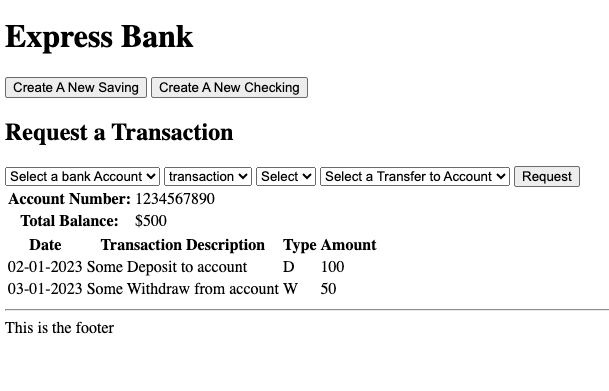

<p align="center">
  <a href="" rel="noopener">
 </a>
</p>

<h3 align="center">Mongo Express Bank</h3>

<div align="center">

[](active)
[](https://github.com/kylelobo/The-Documentation-Compendium/issues)
[](https://github.com/kylelobo/The-Documentation-Compendium/pulls)
[](/LICENSE)

</div>

---

# express-mongo-bank

<p align="center"> Bank System Experimenting with Express and MongoDB
    <br> 
</p>

## 📝 Table of Contents

- [About](#about)
- [Versions:](#versions)
  - 🔧 [V1](#v1)
  - 🔧 [V2](#v2)
- [Authors](#authors)
- [Acknowledgments](#acknowledgement)

# Mongo Express Bank

This is a experimental project to create a full CRUD app. To do so, we're experimenting with a banking system in which user can:

- Create accounts(Saving and Checking) - Create
- Deposit Funds - Update
- Withdraw Funds - Update
- Close an account - Delete
- Keep and display the logs of activities - Create

### Stretch Goals - it's always a nice surprise!

## ⛏️ Built Using <a name = "built_using"></a>

- [MongoDB](https://www.mongodb.com/) - Database
  - mongoose - Database Framework
  - nodemon
- [Express](https://expressjs.com/) - Server Framework
- [NodeJs](https://nodejs.org/en/) - Server Environment
- [CORS](https://www.npmjs.com/package/cors) - Connect/Express middleware
- [Morgan](https://www.npmjs.com/package/morgan) - HTTP request logger middleware for node.js
- [Live Server](https://marketplace.visualstudio.com/items?itemName=ritwickdey.LiveServer) - A Quick Development Live Server with live browser reload.

make sure you have live Server extension install


Random deposits: Receiving a random payrolls deposit.

# Setups:

```sh
npm init -y
npm i cors express mongoose morgan
touch server.js //server route
touch .ignore //add node_modules
```

Update your Scripts block in your package.json

```json
  "scripts": {
    "start": "node server.js",
    "dev": "nodemon server.js"
  },
```

For your `index.html`

```html
<script src="https://unpkg.com/axios/dist/axios.min.js"></script>
<script src=".scripts/script.js" type="module" defer></script>
<link rel="stylesheet" href="style/style.css" />
```

config/db file,

```js
const mongoose = require("mongoose");

mongoose
  .connect("mongodb://127.0.0.1:27017/mongoBankExpress")
  .then(() => {
    console.log("Successfully connected to MongoDB.");
  })
  .catch((e) => {
    console.error("Connection error", e.message);
  });

const db = mongoose.connection;

module.exports = db;
```

# Versions <a name = "#versions"></a>

## 🔧 V1 <a name = "#v1"></a>

1. Create one user total (I'll see if can login)
2. User can create new account by selecting _Create A New Account_ button (Saving / Checking)
3. Uer can deposit/withdraw to/from all of their account (cash,check)
4. User can transfer money from one account to another account
5. User cna only from Checking account.
6. User can delete their account but they need to transfer the balance before that. Balance need to be 0 before request to close an account

Previews:
<p align="center">
 
 
</p>

## 🔧 V2 <a name = "#v2"></a>

1. One user total (I'll see if can login)
2. User can create maximum 4 different accosts (Saving / Checking)
3. Uer can deposit to all of their account (cash,check)
4. User can transfer money from one account to another account
5. User cna only withdraw from Checking account.
6. User can delete their account but they need to transfer the balance before that
7. There should be a log of transactions for each account (the most challenging part)

## 🚀 Run & Deployment <a name = "deployment"></a>

Add additional notes about how to deploy this on a live system.

## ✍️ Authors <a name = "authors"></a>

[Shirin](https://github.com/shirinmjr) - Idea & Initial work

## 🎉 Acknowledgements <a name = "acknowledgement"></a>
